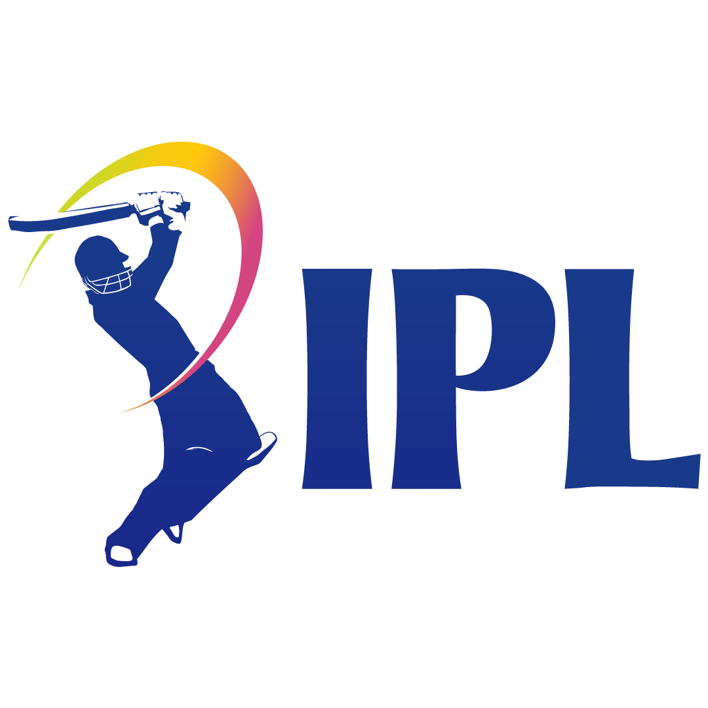

# 🏏 IPL Winning Probability Predictor

<p align="center">
  
</p>

<p align="center">


</p>

---

# 📌 Project Overview

The **IPL Winning Probability Predictor** is a Machine Learning based web application that predicts the probability of the batting team winning an ongoing IPL match in real time.

The application analyzes the current state of a run chase using historical IPL match data and calculates the winning chances based on several match parameters such as current score, overs completed, wickets remaining, target score, required run rate, and match pressure.

A clean and interactive **Streamlit dashboard** allows users to enter live match details and instantly visualize the predicted winning probability using charts and statistical insights.

---

# 🎯 Objectives

- Predict live IPL winning probability
- Perform end-to-end Machine Learning workflow
- Build an interactive Streamlit web application
- Demonstrate feature engineering on cricket data
- Compare multiple Machine Learning algorithms
- Deploy a production-ready ML project

---

# ✨ Features

### 🏏 Match Prediction

- Batting Team Selection
- Bowling Team Selection
- Venue Selection
- City Selection
- Target Score
- Current Score
- Overs Completed
- Wickets Lost

---

### 📊 Live Calculations

The application automatically computes:

- Runs Left
- Balls Left
- Current Run Rate (CRR)
- Required Run Rate (RRR)
- Match Pressure Index
- Run Momentum
- Required Boundary Percentage

---

### 🤖 Machine Learning

Multiple algorithms are trained and evaluated:

- Logistic Regression
- Random Forest
- Gradient Boosting
- XGBoost

The best-performing model is automatically selected and saved.

---

### 📈 Interactive Dashboard

- Winning Probability
- Gauge Chart
- Pie Chart
- Probability Bar
- Run Rate Comparison
- Prediction History
- Export Predictions

---

# 🏗 Project Architecture

```
                User

                  │

                  ▼

         Streamlit Web Interface

                  │

                  ▼

               app.py

                  │

        ┌─────────┴──────────┐

        ▼                    ▼

    predict.py          config.py

        │

        ▼

 Feature Engineering

        │

        ▼

best_model.pkl

        │

        ▼

 Winning Probability

        │

        ▼

 Interactive Dashboard
```

---

# 📂 Project Structure

```
IPL-Winning-Probability-Predictor/

│
├── app.py
├── train.py
├── predict.py
├── config.py
├── utils.py
│
├── requirements.txt
├── README.md
├── LICENSE
├── Procfile
├── setup.sh
├── .gitignore
│
├── data/
│   ├── raw/
│   │   ├── matches.csv
│   │   ├── deliveries.csv
│   │   ├── teams.csv
│   │   └── venues.csv
│   │
│   └── processed/
│       ├── matches_cleaned.csv
│       ├── deliveries_cleaned.csv
│       └── training_data.csv
│
├── models/
│   ├── best_model.pkl
│   ├── scaler.pkl
│   ├── encoder.pkl
│   ├── feature_columns.pkl
│   └── metrics.json
│
├── notebooks/
│
├── reports/
│
├── tests/
│
└── assets/
```

---

# 📊 Dataset

This project uses historical IPL datasets.

### Raw Files

- matches.csv
- deliveries.csv
- teams.csv
- venues.csv

The data undergoes:

- Cleaning
- Missing Value Handling
- Team Name Standardization
- Feature Engineering
- Dataset Preparation

---

# 🧠 Feature Engineering

The following features are generated:

| Feature | Description |
|----------|-------------|
| Current Score | Runs scored by batting team |
| Target | Target score |
| Runs Left | Remaining runs |
| Balls Left | Remaining deliveries |
| Wickets Remaining | Available wickets |
| CRR | Current Run Rate |
| RRR | Required Run Rate |
| Match Pressure Index | Pressure during chase |
| Run Momentum | Match momentum |
| Required Boundary Percentage | Boundary dependency |

---

# 🤖 Machine Learning Workflow

```
Raw Dataset
      │
      ▼
Data Cleaning
      │
      ▼
Feature Engineering
      │
      ▼
Train Test Split
      │
      ▼
Preprocessing
      │
      ▼
Model Training
      │
      ▼
Model Comparison
      │
      ▼
Best Model Selection
      │
      ▼
Model Serialization
      │
      ▼
Streamlit Prediction
```

---

# 📈 Model Comparison

The following algorithms are trained:

| Model | Purpose |
|--------|----------|
| Logistic Regression | Baseline Model |
| Random Forest | Ensemble Learning |
| Gradient Boosting | Boosted Trees |
| XGBoost | Final Selected Model |

Evaluation Metrics:

- Accuracy
- Precision
- Recall
- F1 Score
- ROC-AUC
- Confusion Matrix

---

# 📉 Reports

The training pipeline automatically generates:

- ROC Curve
- Precision Recall Curve
- Confusion Matrix
- Feature Importance
- Learning Curve
- Validation Curve

---

# 🖥 Streamlit Dashboard

The dashboard includes:

- Match Input Form
- Team Selection
- Venue Selection
- Prediction Button
- Winning Probability
- Interactive Charts
- Prediction History
- CSV Export

---

# ⚙ Installation

Clone the repository

```bash
git clone https://github.com/yourusername/IPL-Winning-Probability-Predictor.git
```

Move into the folder

```bash
cd IPL-Winning-Probability-Predictor
```

Create virtual environment

```bash
python -m venv .venv
```

Activate

### Windows

```bash
.venv\Scripts\activate
```

### Linux / Mac

```bash
source .venv/bin/activate
```

Install dependencies

```bash
pip install -r requirements.txt
```

---

# ▶ Training

Train the model

```bash
python train.py
```

This generates

```
models/

best_model.pkl

encoder.pkl

scaler.pkl

feature_columns.pkl

metrics.json
```

---

# ▶ Run the Application

```bash
streamlit run app.py
```

Open

```
http://localhost:8501
```

---

# 🧪 Testing

Run

```bash
pytest
```

---

# 📦 Deployment

Supports

- Streamlit Community Cloud
- Render
- Railway

Deployment files included:

- Procfile
- setup.sh
- requirements.txt

---

# 📸 Screenshots

## Home

> Add screenshot here

---

## Prediction Dashboard

> Add screenshot here

---

## Winning Probability

> Add screenshot here

---

## Charts

> Add screenshot here

---

# 🚀 Future Improvements

- Player statistics integration
- Weather prediction
- Live Cricbuzz API
- Ball-by-ball probability updates
- Deep Learning models
- SHAP Explainability Dashboard
- Team strength ratings
- Mobile responsive UI
- Multi-language support

---

# 👨‍💻 Author

**Asif Shaik**

B.Tech Electronics & Communication Engineering

Institute of Aeronautical Engineering

Hyderabad, India

📧 Email: shaikasif2026@gmail.com

🔗 LinkedIn: https://www.linkedin.com/in/shaikasif369

💻 GitHub: https://github.com/shaik-asif967

---

# 📜 License

This project is licensed under the MIT License.

---

# ⭐ Support

If you found this project useful,

⭐ Star the repository

🍴 Fork the project

📝 Contribute improvements

---

## Thank You ❤️
